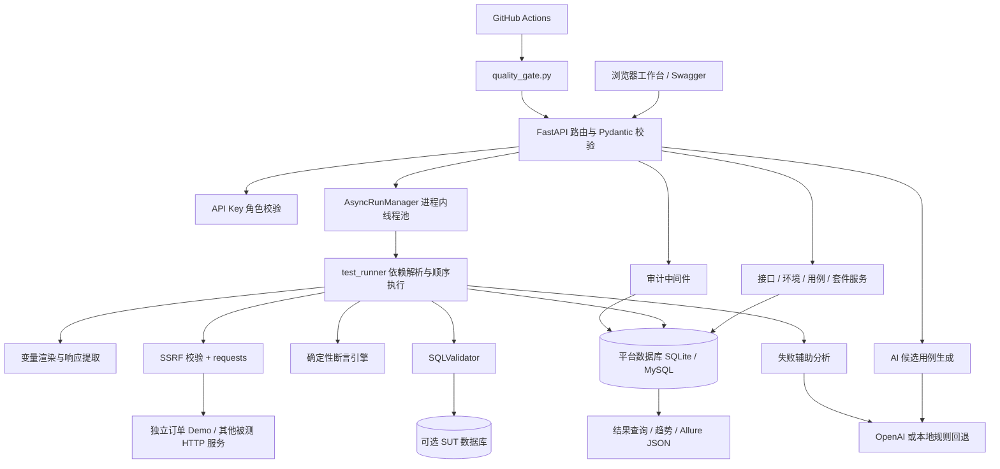
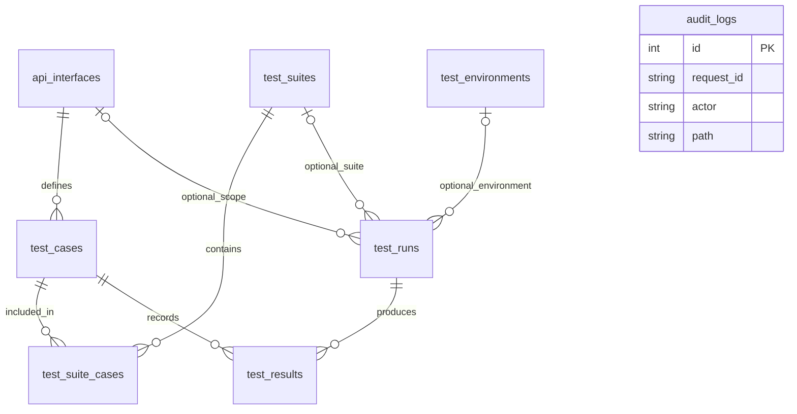
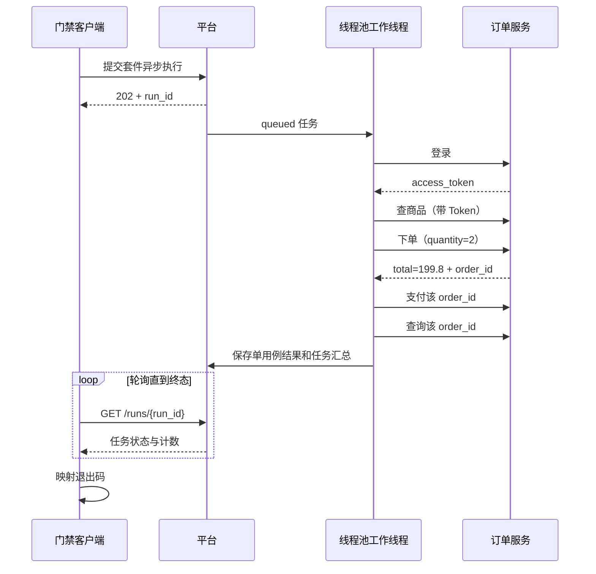

# 项目结构与面试指南

本文依据当前仓库代码整理。阅读顺序建议为：项目定位 → 五步订单演示 → 执行链 → 数据表 → 文件结构 → 面试追问。2026-09-29 清理后验证为 **171 passed，app 行覆盖率 87.44%**。覆盖率比清理前的 86.93% 提升，是删除 12 条未覆盖的旧初始化语句导致统计分母减少，没有新增测试；它不代表所有外部环境均验证通过。完整核验见 [简历项目核对与清理记录](简历项目核对与清理记录.md)。

## 1. 先用一分钟讲清楚项目

> 我做的是一个接口回归质量门禁平台，主要解决接口测试分散、登录令牌和业务 ID 需要手工传递、回归结果不容易接入 CI 的问题。后端用 FastAPI 和 SQLAlchemy，把接口、环境、用例、套件和执行结果持久化。执行时先解析用例依赖，再发送 HTTP 请求，通过 JSON 路径提取 Token 和订单号传给后续接口，用确定性断言判定结果。仓库内置独立订单服务，可以演示登录、查商品、下单、支付、查订单的完整链路；门禁脚本通过提交任务、轮询结果和非零退出码让 CI 失败。AI 用于生成候选异常用例和排查建议，不参与决定测试是否通过。

这里的“内置订单服务”是独立 HTTP 被测服务，数据保存在进程内存，目的是提供可复现演示，不是接入了某个企业真实订单系统。当前 GitHub Actions 有测试、迁移和演示门禁三个任务，没有实际发布任务。

### 能力与边界速查

| 能力 | 当前实现 | 面试时的准确说法 |
|---|---|---|
| 接口与用例管理 | CRUD、筛选、分页；用例保存断言、提取器和依赖 | 可以配置并复用接口回归资产 |
| OpenAPI 导入 | 接收文档对象、识别 paths、部分本地引用和请求示例，生成基础正负用例 | 实现常用 OpenAPI 3 场景，不宣称完整规范兼容 |
| 环境切换 | 相对 URL 与环境 base_url 拼接；公共头、普通变量和加密 secrets | 同一套相对路径用例可切换被测环境，真实环境仍需调整契约与测试数据 |
| 依赖编排 | DFS 补齐前置用例、检测循环、共享运行变量 | 实现串行依赖链；不是并行 DAG 调度系统 |
| 异步执行 | 进程内受限线程池、状态入库、取消和重启中断标记 | HTTP 提交后可轮询；不是分布式队列，也不自动恢复执行 |
| 断言 | 状态码、响应体路径、响应头、耗时、正则、类型、JSON Schema、只读 SQL | 测试结果由代码断言决定 |
| AI 辅助 | OpenAI SDK 调用、JSON/Pydantic 校验、规则回退 | 生成候选用例须复核；无密钥也能完成核心回归 |
| 报告与趋势 | 历史查询、套件通过率/耗时、按运行导出 Allure 结果 JSON | 已有报告数据；不是内置 Allure HTML 托管服务 |
| 质量门禁 | CLI 提交、轮询、返回 0/1/2；CI 执行演示链 | 能使 CI 任务失败，发布阻断需要部署流程依赖此检查 |
| 性能测试 | JMeter 分页接口练习脚本与记录模板 | 有实验入口，没有可据此宣称的生产吞吐或 SLA |

## 2. 整体架构



关键区分：`DATABASE_URL` 连接的是平台元数据数据库，保存测试资产与结果；`SUT_DATABASE_URL` 连接的是被测系统数据库，供 SQL 校验查询。二者有意分离，后者缺失时不会偷偷查询平台库。内置订单服务没有数据库，默认五步套件没有 SQL 校验配置。[配置](../app/utils/config.py#L73)、[SQL 校验](../app/services/sql_validator.py#L53)

平台后端采用常见分层：`api` 接收请求和调用服务，`schemas` 验证输入输出，`services` 实现业务逻辑，`models` 映射数据表。网页是原生 HTML/CSS/JavaScript，由 FastAPI 静态资源服务提供，不依赖 React/Vue 或单独的前端构建流程。

## 3. 详细文件结构表

### 3.1 入口、配置与交付

| 文件 | 职责 | 讲解重点 |
|---|---|---|
| [main.py](../main.py) | 创建 FastAPI、注册路由、挂载静态资源、审计、启动中断修正 | `/health`、`/workbench`、`/docs`；启动时标记遗留 queued/running 任务 |
| [requirements.txt](../requirements.txt) | 运行依赖 | FastAPI、SQLAlchemy、requests、OpenAI SDK、Pydantic、Alembic、jsonschema 等 |
| [requirements-dev.txt](../requirements-dev.txt) | 开发/测试依赖 | 包含运行依赖与 pytest、httpx、pytest-cov |
| [config.yaml](../config.yaml) | 普通默认配置 | 请求超时、模型参数等；环境变量在配置类中覆盖相应项目 |
| [.env.example](../.env.example) | 本地配置示例 | 真实 `.env` 不入库；API Key、数据库、目标地址安全策略 |
| [.gitignore](../.gitignore) | Git 排除项 | 不提交密钥、数据库、虚拟环境及生成物 |
| [.dockerignore](../.dockerignore) | 镜像构建排除项 | 避免本地生成物进入镜像上下文 |
| [Dockerfile](../Dockerfile) | Python 服务镜像 | 同一镜像可运行平台或 Demo，被 Compose 指定启动命令 |
| [docker-compose.yml](../docker-compose.yml) | MySQL、Demo、平台三服务 | 健康检查、迁移和种子数据初始化；启用鉴权并允许访问 demo-sut |
| [start.cmd](../start.cmd) | Windows 启动入口 | 选择 Python 后转交演示脚本 |
| [alembic.ini](../alembic.ini) | Alembic 配置 | 数据库版本演进入口 |
| [.github/workflows/ci.yml](../.github/workflows/ci.yml) | 三个 CI job | 自动测试、MySQL 迁移 smoke、订单 Demo 门禁，无部署 job |
| [conftest.py](../conftest.py) | 测试导入前配置 | 使用测试数据库默认值，强制清空 OpenAI Key，避免测试真实调用模型 |

### 3.2 API 路由

| 文件 | 主要端点 | 作用 |
|---|---|---|
| [interface_api.py](../app/api/interface_api.py) | `/interfaces`、`/interfaces/page`、`/interfaces/{id}` | 接口定义 CRUD、分页筛选 |
| [testcase_api.py](../app/api/testcase_api.py) | `/cases`、`/cases/page`、`/cases/{id}` | 用例 CRUD、按接口/状态筛选 |
| [environment_api.py](../app/api/environment_api.py) | `/environments`、`/environments/{id}` | 环境 CRUD，响应不返回 secrets 明文 |
| [suite_api.py](../app/api/suite_api.py) | `/suites`、`/{id}/runs`、`/{id}/runs/async`、`/{id}/trends` | 套件管理、套件执行、趋势 |
| [run_api.py](../app/api/run_api.py) | `POST /runs`、`POST /runs/async`、`POST /runs/{id}/cancel` | 按接口/用例选择执行与取消 |
| [result_api.py](../app/api/result_api.py) | `GET /runs`、`/runs/{id}`、`/runs/{id}/results`、`/results/{id}` | 任务与单用例结果查询 |
| [openapi_api.py](../app/api/openapi_api.py) | `POST /openapi/import` | 提交已解析为对象的 OpenAPI 文档 |
| [ai_case_api.py](../app/api/ai_case_api.py) | `/ai/interfaces/{id}/cases`、`POST /ai/analyze-result` | 生成并保存候选用例、辅助分析 |
| [report_api.py](../app/api/report_api.py) | `POST /reports/allure?run_id=...` | 从已保存的结果导出 Allure JSON |
| [audit_api.py](../app/api/audit_api.py) | `GET /audit-logs` | 管理员查看审计记录 |
| [system_api.py](../app/api/system_api.py) | `GET /system/info` | 数据库类型与各类记录数量 |
| [security.py](../app/api/security.py) | `require_api_key`、`require_admin` | 校验 `X-API-Key`，按 viewer/operator/admin 控制读写删除 |

表中套件子路径均接在 `/suites` 后。完整参数与响应以运行后的 `/docs` 为准。网页可访问不等于业务 API 无鉴权；本地演示默认关闭鉴权，Compose 配置启用鉴权。

### 3.3 数据模型与请求结构

| 文件 | 主要对象 | 职责 |
|---|---|---|
| [database/db.py](../app/database/db.py) | `Base`、`engine`、`SessionLocal`、`get_db` | 创建 ORM 引擎和请求级 Session，关闭连接 |
| [models/interface.py](../app/models/interface.py) | `ApiInterface` | URL、方法、头、基础数据与契约 |
| [models/testcase.py](../app/models/testcase.py) | `TestCase` | 输入、断言、提取、依赖、重试、启用状态 |
| [models/environment.py](../app/models/environment.py) | `TestEnvironment` | 环境地址、公共变量、公共头、加密密钥 |
| [models/suite.py](../app/models/suite.py) | `TestSuite`、`TestSuiteCase` | 套件配置与套件—用例关联 |
| [models/result.py](../app/models/result.py) | `TestRun`、`TestResult` | 一次批次执行与每个用例的运行快照 |
| [models/audit.py](../app/models/audit.py) | `AuditLog` | 请求身份、路径、状态、耗时 |
| [schemas/interface_schema.py](../app/schemas/interface_schema.py) | `InterfaceCreate/Update/Out/Page` | URL/方法校验、更新与分页输出 |
| [schemas/testcase_schema.py](../app/schemas/testcase_schema.py) | `TestCase*`、`RunRequest`、`AIGenerateRequest`、`AnalyzeRequest` | 用例和执行/AI 请求结构 |
| [schemas/environment_schema.py](../app/schemas/environment_schema.py) | `EnvironmentCreate/Update/Out` | base_url 校验、普通变量拒绝敏感键、secrets 只写 |
| [schemas/suite_schema.py](../app/schemas/suite_schema.py) | `TestSuite*`、`SuiteRunRequest`、`SuiteTrend*` | 去重用例 ID、套件策略覆盖、趋势输出 |
| [schemas/result_schema.py](../app/schemas/result_schema.py) | `TestRunOut`、`TestResultOut`、分页、异步接收响应 | 统一结果 API 结构 |
| [schemas/openapi_schema.py](../app/schemas/openapi_schema.py) | `OpenAPIImportRequest/Result` | 导入开关和创建/更新/跳过计数 |
| [schemas/ai_schema.py](../app/schemas/ai_schema.py) | `GeneratedCase`、`GeneratedCaseBatch` | 对模型输出执行结构和状态码范围校验 |

`__init__.py` 是 Python 包标识；主要业务不写在这些空文件中。

### 3.4 核心服务

| 文件 | 核心函数/类 | 输入到输出及关键规则 |
|---|---|---|
| [test_runner.py](../app/services/test_runner.py) | `select_cases`、`run_cases`、`_execute_case` | 用例选择 → 依赖拓扑顺序 → HTTP/SQL/断言 → 结果入库与汇总 |
| [async_run_service.py](../app/services/async_run_service.py) | `AsyncRunManager`、`create_async_run`、`cancel_run` | 先存 queued 任务，再交给线程池；独立 Session；异常收尾 |
| [variable_service.py](../app/services/variable_service.py) | `build_runtime_variables`、`render_value`、`extract_variables` | 环境和临时变量合并、`${name}` 替换、响应提取 |
| [data_path.py](../app/services/data_path.py) | `get_path` | 支持对象字段、数组下标、通配符的简单 JSONPath 子集 |
| [assertion_service.py](../app/services/assertion_service.py) | `evaluate_assertions` | 统一取实际值和比较，返回可读错误列表 |
| [sql_validator.py](../app/services/sql_validator.py) | `SQLValidator` | 检查单条 SELECT、危险能力、表白名单，查询被测库并比较结果 |
| [target_validator.py](../app/services/target_validator.py) | `validate_target_url` | 仅 HTTP(S)、禁止 URL 凭据、DNS/IP 校验、可配置私网策略 |
| [interface_service.py](../app/services/interface_service.py) | CRUD、`search_interfaces` | 接口管理和筛选，删除时检查关联数据 |
| [testcase_service.py](../app/services/testcase_service.py) | CRUD、`_validate_dependencies` | 校验依赖存在、避免自身/重复依赖，保护被引用和有历史结果的用例 |
| [environment_service.py](../app/services/environment_service.py) | CRUD、`public_environment`、`environment_secrets` | 写入时加密 secrets，执行时解密，响应只列密钥名 |
| [suite_service.py](../app/services/suite_service.py) | CRUD、`suite_case_ids`、`suite_trends` | 存储成员位置、校验启用用例、汇总最近任务趋势 |
| [openapi_service.py](../app/services/openapi_service.py) | `import_openapi`、`_schema_cases` | 按 URL+方法找已有接口，生成有效/缺失/类型/超长请求 |
| [ai_case_service.py](../app/services/ai_case_service.py) | `generate_and_save_cases` | 读取接口上下文、调用生成器、存候选用例；调用者指定预期码优先 |
| [result_service.py](../app/services/result_service.py) | `list_runs`、`list_results`、详情查询 | 按状态/接口/套件筛选历史结果 |
| [report_service.py](../app/services/report_service.py) | `generate_allure_from_run` | 每次导出建立独立目录，从持久化结果生成 JSON，不重放接口 |
| [audit_service.py](../app/services/audit_service.py) | `list_audit_logs` | 按操作者/方法过滤并分页 |

### 3.5 AI、工具、网页

| 文件 | 职责 | 需要知道的细节 |
|---|---|---|
| [ai/openai_client.py](../app/ai/openai_client.py) | SDK 调用、输出解析、规则回退、失败分析 | 生成用例在无密钥、调用异常或 JSON/结构非法时回退；分析文本在无密钥或调用异常时回退 |
| [ai/prompt_templates.py](../app/ai/prompt_templates.py) | 生成用例/分析结果的提示词 | 提示词要求不等于服务端强制业务约束 |
| [utils/config.py](../app/utils/config.py) | 配置加载与缓存 | `.env`、YAML、环境变量；平台库与 SUT 库分别配置 |
| [utils/encryption.py](../app/utils/encryption.py) | Fernet 加解密 | 从配置密钥材料派生密钥，缺少材料时不能写入 secrets |
| [utils/redaction.py](../app/utils/redaction.py) | 按敏感键递归脱敏、截断大字段 | 不是任意自由文本敏感信息检测器 |
| [utils/logger.py](../app/utils/logger.py) | Loguru 日志初始化 | 控制台与本地日志文件 |
| [utils/time_utils.py](../app/utils/time_utils.py) | `utc_now` | ORM 使用不带时区标记的 UTC 时间 |
| [static/index.html](../app/static/index.html) | 中文首页 | 介绍项目、提供工作台/文档入口 |
| [static/home.css](../app/static/home.css) | 首页样式 | 原生 CSS |
| [static/workbench.html](../app/static/workbench.html) | 交互工作台 | 环境、接口、用例、套件、运行和导入表单 |
| [static/workbench.js](../app/static/workbench.js) | 通过 fetch 调 API、轮询任务、渲染结果 | API Key 保存在当前浏览器 localStorage；不属于服务端用户会话系统 |
| [static/workbench.css](../app/static/workbench.css) | 工作台样式 | 页面布局和响应式展示 |
| [static/swagger-theme.css](../app/static/swagger-theme.css) | API 文档主题 | 由 `/docs` 页面插入 |
| [static/swagger-i18n.js](../app/static/swagger-i18n.js) | Swagger 界面汉化辅助 | 不改变 API 行为 |

### 3.6 脚本、迁移和被测服务

| 文件 | 职责 | 说明 |
|---|---|---|
| [scripts/bootstrap_database.py](../scripts/bootstrap_database.py) | 初始化/升级数据库 | 识别旧四表基线后 stamp；正常路径升级到 head |
| [scripts/seed_demo.py](../scripts/seed_demo.py) | 幂等创建 Demo 资产 | 环境、5 接口、5 用例、1 套件；重复执行更新同名演示配置 |
| [scripts/run_demo.py](../scripts/run_demo.py) | 一次启动两个进程 | 先迁移和初始化，再启动 8000 平台与 8010 Demo |
| [scripts/quality_gate.py](../scripts/quality_gate.py) | CI 客户端 | 找套件/环境、异步提交、轮询、输出汇总与退出码 |
| [demo_sut/main.py](../demo_sut/main.py) | 独立 FastAPI 订单服务 | 固定演示账户、内存库存和订单、锁保护写入、可控金额缺陷 |
| [migrations/env.py](../migrations/env.py) | 迁移运行环境 | 加载平台配置与 ORM 元数据 |
| [migrations/script.py.mako](../migrations/script.py.mako) | 新迁移文件模板 | Alembic 使用 |
| [0001_baseline.py](../migrations/versions/0001_baseline.py) | 初始四表 | 接口、用例、任务、结果 |
| [0002_runtime_features.py](../migrations/versions/0002_runtime_features.py) | 扩展运行能力 | 环境、审计、依赖/提取/断言、丰富结果字段 |
| [0003_agent_tasks.py](../migrations/versions/0003_agent_tasks.py) | 历史实验表迁移 | 创建过 agent_tasks/agent_steps，当前功能已移除；保留迁移链 |
| [0004_environment_secrets.py](../migrations/versions/0004_environment_secrets.py) | 环境密钥字段 | 增加加密存储字段 |
| [0005_regression_suites.py](../migrations/versions/0005_regression_suites.py) | 当前套件模型 | 增加套件与关联表、任务套件 ID，移除 Agent 实验表 |
| [performance/README.md](../performance/README.md) | 性能实验说明 | 仅分页只读接口基线练习 |
| [performance/interface_page_baseline.jmx](../performance/interface_page_baseline.jmx) | JMeter 脚本 | 可参数化线程、时间和阈值 |
| [performance/local.properties.example](../performance/local.properties.example) | 本地参数样例 | 实际含 Key 的 local.properties 不入库 |
| [performance/性能测试记录模板.md](../performance/性能测试记录模板.md) | 结果记录模板 | 用于记录环境、吞吐、分位耗时、错误和资源数据 |

### 3.7 测试文件

| 文件 | 主要验证内容 |
|---|---|
| [tests/conftest.py](../tests/conftest.py) | 独立内存 SQLite、StaticPool、FastAPI 数据库依赖替换 |
| [test_health.py](../tests/test_health.py) | 健康检查 |
| [test_dashboard.py](../tests/test_dashboard.py) | 首页/工作台/Swagger 静态入口、系统信息 |
| [test_interface_api.py](../tests/test_interface_api.py) | 接口 CRUD、分页筛选、非法输入和关联删除保护 |
| [test_environment_and_case_api.py](../tests/test_environment_and_case_api.py) | 环境/用例 CRUD、依赖、密钥加密、历史保护 |
| [test_suite_api.py](../tests/test_suite_api.py) | 套件 CRUD、成员存储顺序、默认策略、趋势和删除保护 |
| [test_openapi_import.py](../tests/test_openapi_import.py) | 导入接口和基础用例、默认跳过已有接口、地址模式 |
| [test_runtime_features.py](../tests/test_runtime_features.py) | JSON 路径、模板替换、提取、复合断言、JSON Schema |
| [test_test_runner.py](../tests/test_test_runner.py) | 请求构造、状态断言、运行汇总、依赖变量、脱敏、路径参数 |
| [test_result_and_async_api.py](../tests/test_result_and_async_api.py) | 结果查询、异步接收、取消与选择校验 |
| [test_sql_validator.py](../tests/test_sql_validator.py) | SUT 库配置、只读限制、匹配结果、高风险 SELECT、白名单 |
| [test_security.py](../tests/test_security.py) | 私网/主机解析拦截、显式放行、角色 API Key |
| [test_redaction.py](../tests/test_redaction.py) | 嵌套敏感键遮盖、大字符串截断 |
| [test_ai_case_service.py](../tests/test_ai_case_service.py) | 本地回退类别、解析与校验、保存用例、状态码优先级 |
| [test_report_service.py](../tests/test_report_service.py) | 使用持久化结果导出 Allure、无任务/无结果错误 |
| [test_time_utils.py](../tests/test_time_utils.py) | UTC 时间语义、保存后可比较 |
| [test_demo_sut.py](../tests/test_demo_sut.py) | 五步订单、鉴权/库存错误、金额缺陷开关 |
| [test_quality_gate.py](../tests/test_quality_gate.py) | 查找套件、轮询终态和失败退出码 |

测试中大量外部请求通过替身隔离，适合稳定验证内部逻辑。CI 的 `demo-quality-gate` 另起真实 HTTP 服务补充端到端验证；`migration-smoke` 验证 MySQL 迁移，不等于全部 API 测试都在 MySQL 上运行。

## 4. 八张业务表与关系

最终版本包含八张业务表，另有 Alembic 自身的版本表 `alembic_version`。已移除的 Agent 表不计入当前业务模型。

| 表 | 重要字段 | 关系与用途 |
|---|---|---|
| `api_interfaces` | id、name、url、method、headers、body、spec | 一个接口对应多条用例；存基础契约信息 |
| `test_cases` | interface_id、data、expected_status_code、expected_json、assertions、extractors、dependencies、sql_check、request_config、retry_count | 依赖用例 ID 放在 JSON 数组中，由应用校验，不是单独的依赖关联表 |
| `test_environments` | name、base_url、variables、headers、secrets_encrypted、enabled | 一个环境对应多次任务；环境密钥加密存储 |
| `test_suites` | name、description、fail_fast、analyze_by_ai、enabled | 可重复执行的业务场景配置 |
| `test_suite_cases` | suite_id、case_id、position | 套件和用例多对多，suite_id+case_id 唯一 |
| `test_runs` | interface_id/suite_id/environment_id、status、total/passed/failed、variables、cancel_requested、时间 | 一次执行的任务级摘要；三个外键允许为空以兼容不同执行入口 |
| `test_results` | run_id、case_id、case_name、status、request_data、response_data、response_headers、duration_ms、extracted_variables、attempt、assertion_message、ai_analysis | 每个已执行用例的结果快照，保留排查信息 |
| `audit_logs` | request_id、actor、role、method、path、status_code、duration_ms、client_ip | 独立记录平台 HTTP 操作，没有用户表外键 |



为什么配置放 JSON：不同接口的输入、断言和提取器结构变化大，JSON 便于扩展，也减少表数量。代价是数据库不能直接维护 JSON 依赖的外键、复杂查询与约束更依赖应用层。模型使用外键，但部分删除保护也在服务层显式检查，例如有历史结果的用例不能直接删除。

## 5. 五步核心下单链：最适合现场展示

固定演示数据见 [seed_demo.py](../scripts/seed_demo.py#L85)，被测接口见 [demo_sut/main.py](../demo_sut/main.py#L58)。

| 步骤 | HTTP 请求 | 前置与输入 | 断言 | 提取/后续用途 |
|---|---|---|---|---|
| 1 登录 | `POST /api/login` | demo / demo123 | HTTP 200、code=0、token_type=bearer | `$.data.access_token` → `access_token` |
| 2 查商品 | `GET /api/products/{product_id}` | 依赖登录；product_id=1；Bearer Token | HTTP 200、code=0、stock≥2 | 确保下单前库存条件 |
| 3 下单 | `POST /api/orders` | 依赖商品；product_id=1、quantity=2 | HTTP 201、code=0、total=199.8 | `$.data.id` → `order_id` |
| 4 支付 | `POST /api/orders/{order_id}/pay` | 依赖下单；订单号渲染为路径参数 | HTTP 200、code=0、status=paid | 完成状态变更 |
| 5 查订单 | `GET /api/orders/{order_id}` | 依赖支付；同一个订单号 | HTTP 200、code=0、status=paid | 验证读接口能看到已支付结果 |



这个场景同时展示依赖、鉴权传递、变量渲染、路径参数、金额断言、状态变更验证和 CI 门禁。它不包含实际扣款、第三方支付、库存数据库事务或 SQL 回查。

**重复演示注意：** 商品 1 初始库存为 20，每次成功创建订单扣减 2，同一 Demo 进程连续十次下单后会耗尽。重启 Demo 会重置内存状态。平台 SQLite 历史保留，Demo 内存订单会消失；两者生命周期不同。

## 6. 从点击执行到结果返回，代码如何走

### 6.1 提交与调度

1. 工作台或门禁请求 `POST /suites/{suite_id}/runs/async`。
2. [suite_api._run_payload](../app/api/suite_api.py#L50) 读取成员、环境和套件策略；本次明确传入的策略覆盖套件默认值。
3. [create_async_run](../app/services/async_run_service.py#L84) 先验证用例选择和环境，保存 queued 的 `TestRun`。
4. [AsyncRunManager.submit](../app/services/async_run_service.py#L32) 检查活动任务数量，满时返回 429；线程池运行 `_worker`，每个工作任务创建自己的 Session。
5. `_worker` 调用 [run_cases](../app/services/test_runner.py#L86)，同步执行该任务内部的用例链；工作线程之间可并发，单条链内部按顺序执行。

当前默认工作线程数为 4、活动任务上限为 100，可通过配置修改。“异步”指提交后后台执行，不代表每个 HTTP 请求都使用 async HTTP 客户端。

### 6.2 依赖与变量

`select_cases` 不允许既不选接口又不选用例的隐式全量执行。它按 ID 取启用用例，再通过 DFS 找依赖。`visiting` 集合检测循环，`visited` 避免同一前置用例重复执行；缺失或禁用依赖会报错。[依赖解析](../app/services/test_runner.py#L32)

运行变量覆盖顺序为：内置 timestamp/timestamp_ms/uuid → 环境普通变量及解密 secrets → 本次运行 variables → 成功用例新提取的变量。`${name}` 占满整个字符串时保留原始类型，例如订单 ID 为数字时仍可保持数字；混在字符串中时转为文本。[变量渲染](../app/services/variable_service.py#L19)

执行顺序有一个现有限制：套件成员 `position` 已保存并按顺序读出，但 `select_cases` 重新按用例 ID 升序查询，再执行 DFS；因此无依赖的用例不保证按套件传入位置执行。业务先后必须显式写 `dependencies`，不要把列表顺序当作依赖。

### 6.3 单用例执行

1. 将 `case.data` 中的变量替换，渲染接口 URL 和请求头。
2. 将 `request_config.path_parameters` 指定的字段移入 URL，使用 URL 编码后替换 `{字段名}`。
3. 相对路径与环境 base_url 合并；环境公共头先合并，接口头覆盖同名项。
4. 校验目标 URL 和 DNS/IP；发请求时关闭自动重定向，避免通过 302 跳转绕过校验。
5. GET 使用 query 参数；POST/PUT/PATCH/DELETE 根据配置发 JSON 或表单。当前没有完整独立 query/body 参数模型、文件上传或 multipart 支持。
6. 解析响应：对象直接使用；数组等包成 `{"data": ...}`；非 JSON 包成 `{"text": ...}`。断言路径应匹配平台保存后的结构。
7. 执行状态码、顶层 expected_json、多维断言和可选 SQL 校验；没有错误才提取变量。
8. 可按 retry_count 重试失败请求；最终失败且开启 AI 时附加分析建议。
9. 将请求/响应/提取变量按敏感键脱敏后放入结果模型；真实提取值只用于内存中的后续链路。

状态判断依据 [test_runner._execute_case](../app/services/test_runner.py#L169) 和 [assertion_service](../app/services/assertion_service.py#L35)。SQL、网络等错误也可能表现为 failed 结果，当前没有独立的 error 结果类型。

### 6.4 汇总、取消与重启

任务在开始执行时提交 running 状态，单用例结果累计加入 Session，正常结束时统一提交最终结果和计数。当前不是每个用例结束就提交可恢复检查点；中途进程退出可能丢失尚未提交的结果。

`fail_fast=true` 在首个失败后结束循环；最终 total 被改为实际已执行数量，没有逐条写出剩余用例的 skipped 结果。取消未开始的任务尝试 `Future.cancel()`；运行中在两条用例之间检查标记，不能立刻中断正在发送的 HTTP 请求。启动时把遗留 queued/running 标记为 interrupted，不重放原任务。[取消与中断](../app/services/async_run_service.py#L115)

若前置用例失败且没有启用 fail_fast，当前循环仍可继续执行后续用例；它不是“按失败依赖自动跳过后继”的调度器。内置套件开启 fail_fast，减少这类连带失败。

## 7. 断言、SQL 和 AI 如何分别讲

### 7.1 断言示例

```json
{
  "expected_status_code": 201,
  "assertions": [
    {"source": "body", "path": "$.data.total", "operator": "eq", "expected": 199.8},
    {"source": "duration_ms", "operator": "lt", "expected": 1000},
    {"source": "header", "path": "content-type", "operator": "contains", "expected": "application/json"}
  ],
  "extractors": [
    {"name": "order_id", "source": "body", "path": "$.data.id"}
  ]
}
```

示例的 1000 ms 只是用户配置的功能性耗时阈值，不是项目测得的生产 SLA。JSONPath 支持 `$`、`.field`、`[0]`、`['field']` 和 `[*]` 等简单路径，不支持完整标准中的过滤表达式、递归下降或切片。`json_schema` 是显式断言操作符；OpenAPI 导入的“Schema 用例”主要指根据请求字段生成基础输入，不代表自动生成完整响应契约断言。

### 7.2 SQL 校验

SQL 校验先判断是否是单条 SELECT，拒绝写入语句、多语句，以及部分高风险 SELECT 能力；可配置表白名单，并限制读取结果行数。expected 为对象时检查该行是否存在；为列表时检查整个结果列表是否相等；未提供 expected 则仅说明查询成功。[实现](../app/services/sql_validator.py#L18)

需要连接真实被测库并使用只读账号。当前 SQL 安全检查依赖正则，不是完整 SQL 语法分析器；fetchmany 限制的是返回读取行数，不等于数据库查询成本或执行时间上限。`${变量}` 替换也不是 SQL 参数绑定，真实接入前应补充绑定参数和数据库权限/超时控制。默认 Demo 没有 SQL 回查，不应把“已实现校验器”讲成“已完成订单数据库端到端验证”。

### 7.3 AI 候选与规则回退

生成链：接口上下文 + 正常输入 → 提示词 → OpenAI → JSON 解析 → Pydantic 校验 → 保存候选用例。模型不可用或结构不合法时改走规则生成，覆盖字段缺失/null/非法类型，以及字符串空值/空格/固定 256 字符/特殊字符，另加 SQL 注入和 XSS 字符串候选。[AI 客户端](../app/ai/openai_client.py#L29)

这些规则不是完整数值边界生成器：没有通用地依据 numeric minimum/maximum 生成全部边界组合，也没有证明目标系统存在 SQL 注入/XSS 漏洞。生成内容需要复核必填性、类型转换行为、业务前置、预期状态码和断言；当前没有单独的审批状态，生成接口会直接保存用例。

明确指定 expected_status_code 时，保存服务优先采用调用者给定值；未指定时允许生成器分别给出预期。结构校验只证明字段形状合法，不证明用例业务正确。失败分析是建议文本，不改变 passed/failed 状态。

## 8. 安全设计和实际覆盖范围

| 设计 | 已实现 | 还需明确的限制 |
|---|---|---|
| API Key | 比较 Key，viewer 只读，operator 可写，admin 可删除和读审计 | 没有完整用户/租户/细粒度资源权限系统；本地演示默认关闭 |
| SSRF | HTTP(S)、主机名/DNS/IP 检查、拒绝 URL 凭据、关闭重定向 | 请求前检查与实际连接存在时间差，不能替代出口网络控制；显式白名单允许目标私网主机 |
| 环境 secrets | Fernet 加密、接口返回 key 名、执行时解密 | 普通 headers/接口定义不能等同于全量加密；需要妥善管理加密密钥 |
| 脱敏 | 请求/响应字典和环境输出按敏感字段名递归遮盖，模型分析响应做截断 | 自由文本、断言错误文本和 AI 生成原始 input_data 未全部统一脱敏，不能保证全链路无敏感信息 |
| SQL | SELECT 限制、危险片段拒绝、可选表白名单、读取行数上限 | 还需要只读数据库账号、参数绑定、查询成本与时间限制 |
| 审计 | 非 health/静态资源请求记录路径、角色、状态与耗时 | 审计写入异常被吞掉以免影响业务，不是不可丢失审计系统 |

## 9. CI 门禁与本地演示

### 9.1 三个 CI 任务分别证明什么

| Job | 操作 | 可以支持的结论 |
|---|---|---|
| `test` | Python 3.12 安装开发依赖，运行 tests 和 app 覆盖率≥80%门禁 | 当前自动化测试与覆盖率阈值通过 |
| `demo-quality-gate` | SQLite 初始化、启动两个真实 HTTP 进程、执行门禁、上传汇总和日志 | 内置订单流程能通过公共 API 驱动并接入 CI |
| `migration-smoke` | MySQL 8.0 服务、`alembic upgrade head`、查询 revision | 完整迁移链能在该 CI MySQL 环境执行 |

目前三个 job 没有发布步骤。可以说“质量门禁失败使 CI 失败，为发布流程提供阻断信号”；不能说仓库已实现“失败后自动阻断实际生产发布”。实际发布需要下游部署 job 依赖门禁成功，或仓库分支保护要求检查通过。

### 9.2 退出码的精确定义

| 退出码 | 当前脚本含义 | 例子 |
|---|---|---|
| 0 | 返回任务 passed 且 failed=0 | 五步链全部通过 |
| 1 | 取得任务终态，但不符合通过条件 | 断言失败；平台保存为 failed 的单用例网络/SQL异常；cancelled/interrupted |
| 2 | 门禁客户端捕获的 RuntimeError | 找不到套件/环境、HTTP 请求错误、无法连接平台、轮询超时 |

`2` 不是所有运行异常的统一分类：比如 Python 运行时未捕获异常也可能直接终止，目标接口连接失败通常已被执行器记为 failed。面试按“通过 / 任务不通过 / 门禁调用错误”解释更准确。[门禁实现](../scripts/quality_gate.py#L109)

本次独立端到端验证实测：正常五步为 0；金额缺陷为 1（两条通过、第三条失败后停止）；被测服务不可达为 1；平台不可达为 2。

### 9.3 可直接照做的演示步骤

首次准备（已安装依赖时无需重复）：

```powershell
python -m venv .venv-codex
.\.venv-codex\Scripts\python.exe -m pip install -r requirements-dev.txt
Copy-Item .env.example .env
```

已有 `.env` 时保留现有配置，不要重复覆盖。启动平台与内置订单服务：

```powershell
.\.venv-codex\Scripts\python.exe scripts/run_demo.py
```

打开 `http://127.0.0.1:8000/workbench`，展示“内置订单服务”环境、“核心下单回归”套件和用例的依赖/提取器。若环境已显式启用鉴权，填写对应 API Key；演示默认关闭鉴权。

在第二个终端执行门禁：

```powershell
.\.venv-codex\Scripts\python.exe scripts/quality_gate.py --suite-name "核心下单回归" --output reports/quality-gate.json
$LASTEXITCODE
```

预期为 total=5、passed=5、failed=0，退出码 0。再展示运行详情里的 Token 脱敏、请求响应、金额断言和订单状态。

停止演示服务，在启动终端打开受控缺陷后重启：

```powershell
$env:DEMO_BUG_MODE = "wrong_total"
.\.venv-codex\Scripts\python.exe scripts/run_demo.py
```

第二个终端重新执行同一门禁。金额从 199.8 变成 200.8，第三条用例失败；因为套件开启 fail_fast，正常情况下汇总 total=3、passed=2、failed=1，退出码 1。结束演示后清除变量并重启恢复：

```powershell
Remove-Item Env:DEMO_BUG_MODE -ErrorAction SilentlyContinue
.\.venv-codex\Scripts\python.exe scripts/run_demo.py
```

如果需要讲“接真实环境”，展示环境 base_url、相对接口 URL、公共头和 secrets 即可。真实服务的登录、数据准备、状态码与结构不同，需要相应维护用例；更换 base_url 并不保证任意订单系统直接兼容。

## 10. 面试追问与参考回答

| 追问 | 可以按这个逻辑回答 |
|---|---|
| 为什么做这个项目？ | 手工调单接口难以重复覆盖有依赖的业务链。我把测试资产、依赖变量、结果历史和 CI 信号串起来，使回归可复用、可追查。 |
| 为什么选 FastAPI？ | 当前代码直接利用 Pydantic 校验请求、依赖注入管理 DB Session/鉴权、自动生成 OpenAPI 文档，适合做配置型测试平台。同步 HTTP 工作放到后台线程池执行。 |
| 接口、用例、套件有什么区别？ | 接口描述怎么调用；用例描述输入、预期和依赖；套件组织一个可反复执行的业务回归场景；run/result 分别保存批次和单用例结果。 |
| Token 怎么传给下一个接口？ | 登录响应通过 `$.data.access_token` 提取进本次运行的变量字典；后续头里的 `${access_token}` 被替换。真实值只在当前链路内存使用，保存结果按敏感键遮盖。 |
| 如何防止循环依赖？ | DFS 中用 visiting 标识当前递归栈，再次遇到 visiting 的节点即循环；visited 防止共享前置被重复执行。缺失/禁用依赖也拒绝执行。 |
| 异步怎么实现？ | 先持久化 queued 任务并返回 202，再用 ThreadPoolExecutor 执行；客户端轮询数据库状态。工作线程数和活动任务数有上限；单任务内部串行。 |
| 多实例部署会怎样？ | 当前线程池和 Future 在进程内，启动时还会统一标记遗留任务中断，因此不能直接扩成多实例。后续要独立队列/worker、任务租约和心跳、幂等、分段持久化。 |
| 为什么运行表和结果表拆开？ | 任务表快速提供总体状态、计数和耗时，结果表提供失败接口的请求响应与断言证据，便于分页和追查。 |
| 为什么不用 AI 直接判定通过？ | 回归需要可重复的判断标准，AI 输出不稳定。AI 只补充候选输入和排查方向，最终状态仍由状态码、字段、Schema 或 SQL 等确定性断言给出。 |
| 模型不可用怎么办？ | 生成侧回退到本地字段变异规则，分析侧回退到状态码和断言对应的建议；核心执行和门禁不依赖模型在线。 |
| 如何证明门禁真的能发现缺陷？ | 先跑正常五步链，再打开金额错误开关，让下单金额多 1 元；同一条金额断言失败，CLI 返回 1，CI 步骤也会失败。 |
| SQL 校验查的是哪个库？ | 明确配置 SUT_DATABASE_URL 查询被测业务库，不查平台元数据。当前 Demo 内存存储，因此五步示例没有 SQL 回查。 |
| 什么叫完整覆盖？ | 我只陈述具体测试和覆盖率口径。app 语句覆盖率能帮助发现未测代码，但不能证明分支、业务组合、真实网络/数据库或安全场景全部覆盖。 |
| 能保证任意套件顺序吗？ | 当前依赖关系可以保证前置先执行；无依赖成员仍按用例 ID 取数，position 尚未完整传递给执行器。这是明确的后续改进点。 |
| 重试是否会重复下单？ | 有风险。当前重试会重新发请求，默认演示用例 retry_count=0。真实创建/支付接口应结合幂等键和用例策略，不能无差别重试非幂等请求。 |
| 你会优先改什么？ | 先修正顺序、异常分类和失败依赖跳过；再补逐步持久化与任务恢复；扩大规模时引入独立队列；同时补自由文本脱敏和 SQL 参数绑定。 |

回答时把“当前已实现”和“下一步设计”分开。可以讨论分布式队列、Flaky 识别、消息通知、版本基线、发布联动等方向，但仓库当前没有这些完整能力。

## 11. 五分钟讲解路线

1. **第 1 分钟：问题与边界。** 用一分钟介绍项目，说清平台与被测服务是两个进程，AI 是辅助。
2. **第 2 分钟：业务链。** 展示五条用例、Token 和 order_id 的提取及复用，讲金额和支付状态断言。
3. **第 3 分钟：实现。** 展示分层、八表关系、DFS 依赖解析、线程池和结果持久化。
4. **第 4 分钟：验证。** 正常门禁通过，缺陷开关使第三步失败，用 CI 配置说明如何接入。
5. **第 5 分钟：取舍。** 讲单实例边界、顺序限制、AI 规则回退和候选复核，提出有先后次序的改进计划。

优先熟读 [test_runner.py](../app/services/test_runner.py)、[async_run_service.py](../app/services/async_run_service.py)、[seed_demo.py](../scripts/seed_demo.py)、[quality_gate.py](../scripts/quality_gate.py) 四个文件。它们共同构成“配置资产 → 真实调用 → 判定结果 → CI 信号”的主要证据链。
